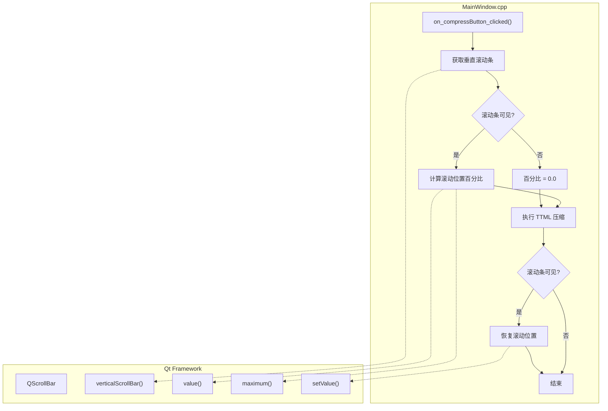

# 压缩时保持滚动位置

## 1. 高层摘要（TL;DR）

- **影响范围：** 🟢 低 - 用户体验优化
- **核心改动：** 在TTML文本压缩功能中增加了滚动条位置保持逻辑
- **关键变更：**
  - ✨ 新增 `QScrollBar` 头文件引用
  - ✨ 在 `on_compressButton_clicked()` 中实现滚动位置保存与恢复
  - ✨ 使用百分比计算确保滚动位置精确恢复

---

## 2. 可视化概览（代码与逻辑映射）

---

## 3. 详细变更分析

### 📁 组件：MainWindow（主窗口）

#### 🔧 变更内容：TTML压缩功能的滚动位置保持

**问题背景：**
在压缩TTML文本时，文本内容会发生变化，导致滚动条位置重置到顶部。这会影响用户体验，特别是当用户正在查看文档的某个特定部分时。

**解决方案：**
在执行压缩操作前后，保存并恢复滚动条的相对位置（百分比），确保用户视角不会丢失。

**代码逻辑详解：**

| 步骤 | 操作 | 代码实现 | 说明 |
|------|------|----------|------|
| 1 | 获取滚动条 | `auto* scroll_bar = ui->TTMLTextEdit->verticalScrollBar()` | 获取文本编辑器的垂直滚动条对象 |
| 2 | 初始化百分比 | `double scroll_percent = 0.0` | 默认值为0，处理不可见情况 |
| 3 | 检查可见性 | `if (scroll_bar->isVisible())` | 仅在滚动条可见时保存位置 |
| 4 | 计算百分比 | `scroll_percent = static_cast<double>(scroll_bar->value()) / scroll_bar->maximum()` | 使用相对位置而非绝对值 |
| 5 | 执行压缩 | `ui->TTMLTextEdit->setPlainText(compressTtml(...))` | 原有逻辑不变 |
| 6 | 恢复位置 | `scroll_bar->setValue(static_cast<int>(scroll_percent * scroll_bar->maximum()))` | 按百分比恢复滚动位置 |

**关键设计决策：**

- ✅ **使用百分比而非绝对值：** 压缩后文本长度变化，绝对位置可能超出范围，百分比更可靠
- ✅ **可见性检查：** 避免在滚动条不可见时进行无效计算
- ✅ **类型安全转换：** 使用 `static_cast` 确保类型转换安全

**头文件变更：**

| 新增头文件 | 用途 |
|------------|------|
| `#include <QScrollBar>` | 提供滚动条相关类和方法 |

---

## 4. 影响与风险评估

### ⚠️ 破坏性变更
- **无** - 纯功能增强，不影响现有API或数据结构

### 🧪 测试建议

| 测试场景 | 预期行为 |
|----------|----------|
| **短文本压缩** | 滚动条不可见，压缩正常完成，无副作用 |
| **长文本压缩（滚动条在顶部）** | 压缩后滚动条仍保持在顶部 |
| **长文本压缩（滚动条在中间）** | 压缩后滚动条保持在相对相同位置 |
| **长文本压缩（滚动条在底部）** | 压缩后滚动条保持在底部 |
| **多次连续压缩** | 每次压缩后滚动位置都能正确保持 |

### 📊 风险等级
- 🟢 **低风险** - 代码逻辑简单，边界条件处理完善，不涉及核心业务逻辑

---